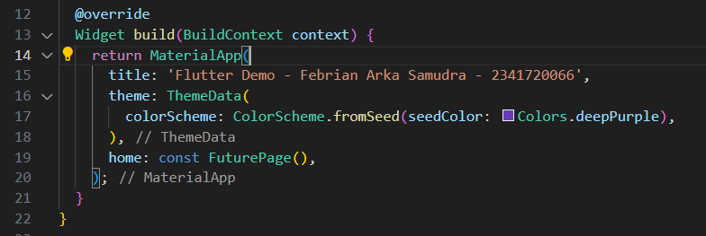
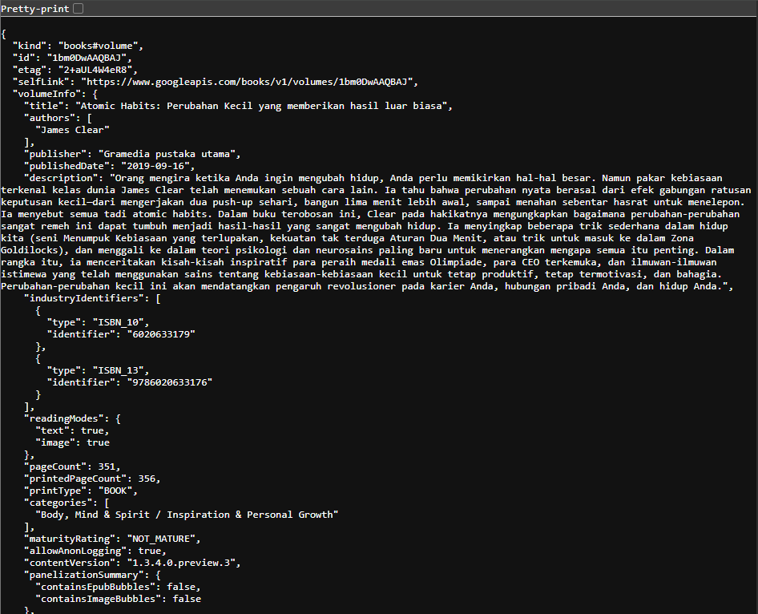

# Pemrograman Asynchronous

## Practicum 1

- **Question 1 :** 


- **Question 2 :**


- **Question 3 :**
- - Explain the meaning of step 5 regarding substring and catchError!
The onPressed code in the ElevatedButton is used to fetch data asynchronously when the button is pressed. The getData() function is executed, and if it succeeds, the response body is converted to a string and trimmed using substring(0, 450) to display only the first 450 characters, preventing the UI from being overloaded with long text. Then, setState() is called to update the UI with the fetched result. If an error occurs, for example due to a failed connection or if the string is shorter than 450 characters, catchError catches the exception and assigns the message 'An error occurred' to the result variable, followed by another setState() call to update the UI with the error message. This ensures that partial data is displayed when successful and that the app does not crash when an error occurs.


## Practicum 2

### Explanation of Steps 1 and 2 (Question 4)

**Step 1: Three Async Methods**
```dart
Future<int> returnOneAsync() async {
  await Future.delayed(const Duration(seconds: 3));
  return 1;
}

Future<int> returnTwoAsync() async {
  await Future.delayed(const Duration(seconds: 3));
  return 2;
}

Future<int> returnThreeAsync() async {
  await Future.delayed(const Duration(seconds: 3));
  return 3;
}
```
These three methods demonstrate asynchronous operations in Flutter/Dart:
1. Each method returns a `Future<int>`, indicating an async operation that will produce an integer value
2. The `async` keyword marks these methods as asynchronous
3. `Future.delayed()` simulates a time-consuming process (3-second delay)
4. After the delay, each method returns a different number (1, 2, and 3)

**Step 2: count() Method**
```dart
Future<void> count() async {
  setState(() {
    result = '';
    _loading = true;
  });
    
  try {
    int total = 0;
    total = await returnOneAsync();      
    total += await returnTwoAsync();     
    total += await returnThreeAsync();   
    setState(() {
      result = total.toString();
      _loading = false;
    });
  } catch (e) {
    setState(() {
      result = 'An error occurred';
      _loading = false;
    });
  }
}
```
The `count()` method demonstrates the use of async/await for sequential operations:
1. Initially clears the result and shows a loading indicator
2. Uses `await` to wait for the result of each async operation sequentially
3. Sums the results from all three methods (1 + 2 + 3 = 6)
4. Total time taken is approximately 9 seconds because:
   - Waiting for `returnOneAsync()` (3 seconds)
   - Waiting for `returnTwoAsync()` (3 more seconds)
   - Waiting for `returnThreeAsync()` (3 more seconds)
5. Final result (6) is displayed in the UI using `setState()`
6. If an error occurs, it will display "An error occurred"

This code illustrates important concepts in asynchronous programming in Flutter:
- Using Future for time-consuming operations
- Managing loading states during async processes
- Using await to wait for async operation results
- Error handling with try-catch
- Updating UI after async operations complete


## Practicum 3
### Step 2: Adding Completer Implementation (Question 5)

This step introduces the use of `Completer` in asynchronous programming:

```dart
late Completer completer;

Future getNumber() {
  completer = Completer<int>();
  calculate();
  return completer.future;
}

Future calculate() async {
  await Future.delayed(const Duration(seconds: 5));
  completer.complete(42);
}
```

**Code Explanation:**

1. **Late Completer Variable:**
  - `late Completer completer;` declares a Completer that will be initialized later
  - Completer is a tool for creating Futures and controlling when they complete

2. **getNumber() Method:**
  - Creates a new `Completer<int>` instance
  - Calls `calculate()` to start the async operation
  - Returns `completer.future` immediately, allowing asynchronous handling
  - The Future will complete when `completer.complete()` is called

3. **calculate() Method:**
  - Simulates a 5-second processing time using `Future.delayed`
  - After the delay, calls `completer.complete(42)` to resolve the Future
  - The value 42 will be delivered to any code awaiting the Future

Result :


### Question 6

Difference between Step 2 (Completer-based getNumber) and Steps 5–6 (calculate with try/catch and then/catchError handling)

Answer: Step 2 shows a minimal Completer pattern that simply completes a Future after a delay. Steps 5–6 add explicit error-handling inside `calculate()` (using try/catch and `completer.completeError`) and add a `.catchError(...)` handler to the `getNumber().then(...)` call so the UI can react to errors. The result is a safer, more robust flow that propagates failures instead of leaving the Future unresolved.

Detailed comparison
- Step 2 (minimal Completer flow)

```dart
late Completer completer;

Future getNumber() {
  completer = Completer<int>();
  calculate();            // starts work that will eventually call completer.complete(...)
  return completer.future; // caller awaits or attaches then()
}

Future calculate() async {
  await Future.delayed(const Duration(seconds: 5));
  completer.complete(42);
}
```

Behavior and risks:
1. `getNumber()` returns a Future immediately; `calculate()` completes it later with `42`.
2. If `calculate()` throws an exception or never calls `completer.complete(...)`, the returned Future will either complete with an error (if exception propagates to the caller) or hang forever (if the exception is swallowed and `complete` is never called).
3. There is no explicit error propagation or timeout—this is the minimal pattern for demonstrating a Completer.

- Steps 5–6 (explicit error propagation and consumer-side catch)

calculate() was changed to:

```dart
Future calculate() async {
  try {
    await Future.delayed(const Duration(seconds: 5));
    completer.complete(42);
  } catch (_) {
    completer.completeError({}); // signal failure to anyone waiting on completer.future
  }
}
```

and the caller uses:

```dart
getNumber()
  .then((value) {
    setState(() { result = value.toString(); });
  })
  .catchError((e) {
    setState(() { result = 'An error occurred'; });
  });
```

What this changes:
1. Error propagation: `calculate()` explicitly calls `completer.completeError(...)` inside the catch block so that the Future returned by `getNumber()` completes with an error instead of never completing. This makes failures observable to callers.
2. Consumer handling: the caller attaches `.catchError(...)` to handle errors and update the UI. If the completer completes with an error, the `.then(...)` success callback will be skipped and `.catchError(...)` will run.
3. Robustness: the new pattern prevents silent hangs and gives a clear place to react to failures.

Subtle differences and best practices
- Completer semantics: always complete a Completer exactly once — either `complete(value)` or `completeError(error)`. Completing it twice or never completing it are both bugs.
- Use typed Completer: `late Completer<int> completer;` rather than an untyped Completer for better type-safety.
- UI state: in your code `count()` updates `_loading` before work and sets it back afterwards. The `getNumber()` / `calculate()` flow in the README example doesn't toggle `_loading`. For consistent UX you should set `_loading = true` before starting and set `_loading = false` in both the success and error handlers.
- Await vs then/catchError: using `async`/`await` with try/catch (linear style) is generally easier to read and reason about. Using `.then(...).catchError(...)` is equivalent but uses callbacks and can be trickier with nested logic. Either approach is fine if error handling is correct.

